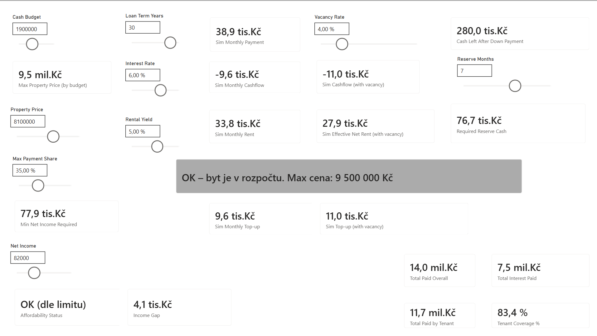

# Investiční byt – interaktivní kalkulačka proveditelnosti (SQL + Power BI)

## Náhled dashboardu

---

## 🇨🇿 Česká verze

Tento projekt představuje interaktivní finanční kalkulačku simulující ekonomickou proveditelnost nákupu investičního bytu financovaného hypotékou.  

Cílem modelu je převést komplexní finanční rozhodnutí domácnosti do srozumitelných metrik a umožnit rychlé vyhodnocení, zda je investice dlouhodobě udržitelná.

### Uživatel může pomocí ovládacích prvků měnit:

- výši vlastního kapitálu domácnosti,
- cenu nemovitosti,
- délku splácení hypotéky,
- úrokovou sazbu,
- očekávaný výnos z nájmu,
- míru neobsazenosti bytu,
- čistý příjem domácnosti,
- maximální podíl splátky na příjmu.

### Na základě těchto vstupů model počítá:

- výši úvěru a měsíční splátku hypotéky,
- očekávaný nájem a čistý měsíční cashflow,
- nutný měsíční doplatek domácnosti,
- minimální požadovaný příjem dle bankovních limitů,
- dlouhodobé náklady na úvěr,
- podíl hypotéky pokrytý nájemníkem,
- celkovou finanční proveditelnost investice.

Model je plně interaktivní a umožňuje okamžitě sledovat dopady změn vstupních parametrů na finanční situaci domácnosti.

---

### Jak projekt otevřít

1. Stáhněte soubor `.pbix`
2. Otevřete v aplikaci Power BI Desktop
3. Interaktivně upravujte vstupy pomocí sliderů

Projekt nevyžaduje žádné externí zdroje dat – model je plně samostatný.

---

## 🇬🇧 English version

This project demonstrates an interactive Power BI model used to evaluate the financial feasibility of purchasing a rental property financed by a mortgage.

The goal of the model is to translate complex household financial decisions into understandable metrics and allow users to quickly determine whether the investment is sustainable.

### Users can adjust key inputs such as:

- available household capital,
- property price,
- mortgage term length,
- interest rate,
- expected rental yield,
- vacancy rate,
- household net income,
- maximum acceptable payment-to-income ratio.

### Based on these inputs, the model calculates:

- loan amount and monthly mortgage payment,
- expected rent and monthly cashflow,
- required monthly top-up from the household,
- minimum income required by lending constraints,
- long-term borrowing costs,
- portion of the mortgage covered by tenants,
- overall investment feasibility.

The dashboard is fully interactive and allows users to immediately observe how financial outcomes change when assumptions are adjusted.

---

### How to explore the project

1. Download the `.pbix` file
2. Open it in Power BI Desktop
3. Adjust inputs using the sliders to explore different scenarios

The model is fully self-contained and does not require any external data sources.
